# Git: решение конфликта между версиями файла на локальной машине и в удаленном репозитории

В данном руководстве используются:
- хостинг репозиториев GitHub для размещения проекта-примера;
- Git Bash как консольный клиент Git;
- плагин Git Graph для Visual Studio Code как средство визуализации дерева проекта.

Пусть имеется проект `merge-conflict-manual`, использующий систему контроля версий Git. Вы клонировали его на локальную машину в момент, когда дерево проекта имело следующий вид:

<!--используем HTML-изображение вместо Markdown, чтобы настроить ширину изображений-->
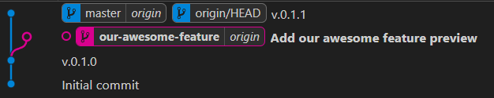

Вами ведется разработка новой функциональности в ветке `our-awesome-feature`.

<!--сделать ссылку неактивной: https://gist.github.com/alexpeattie/4729247?permalink_comment_id=1627517#gistcomment-1627517; иначе при открытии в браузере README.md становится кликабельной ссылкой-->
Пусть необходимо отредактировать файл README<i></i>.md. Изначально он имеет следующий вид:

```markdown
# Merge conflict manual

This is our truly awesome guide how to resolve merge conflicts in Git

Version 28.01.2024

There can be 2 types of problems while resolving merge conflicts in existing files:
1. Adding new content
2. Removing old content

Our awesome feature to resolve merge conflicts includes...
```

Предположим, вы изменили содержимое файла:
- удалили строку `Version 28.01.2024`;
- изменили текст следующего абзаца.

После ваших изменений файл имеет вид:

```markdown
# Merge conflict manual

This is our truly awesome guide how to resolve merge conflicts in Git

There can be 3 types of problems while resolving merge conflicts in existing files:
1. Adding new content
2. Removing old content
3. Updating existing sections of content

Our awesome feature to resolve merge conflicts includes...
```

При проверке наличия изменений в удаленном репозитории командой `git pull` возникает ошибка:

```bash
EP@E-NEWMAN-PC MINGW64 ~/Documents/GitHub/merge-conflict-manual (our-awesome-feature)
$ git pull
remote: Enumerating objects: 5, done.
remote: Counting objects: 100% (5/5), done.
remote: Compressing objects: 100% (2/2), done.
remote: Total 3 (delta 1), reused 0 (delta 0), pack-reused 0
Unpacking objects: 100% (3/3), 917 bytes | 183.00 KiB/s, done.
From https://github.com/E-Newman/merge-conflict-manual
   ff73da7..0763479  our-awesome-feature -> origin/our-awesome-feature
error: Your local changes to the following files would be overwritten by merge:
        README.md
Please commit your changes or stash them before you merge.
Aborting
Updating ff73da7..0763479
```

Она возникла, поскольку ваш коллега отправил свой коммит в репозиторий, пока вы вносили изменения в локальный файл, и теперь README<i></i>.md в удаленном репозитории имеет вид:

```markdown
# Merge conflict manual

This is our truly awesome guide how to resolve merge conflicts in Git

Version 29.01.2024

There can be 2 types of problems while resolving merge conflicts in existing files:
1. Adding new content
2. Removing old content

Our awesome feature to resolve merge conflicts includes...
```

Дерево проекта:

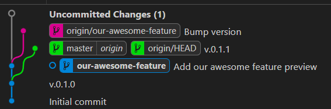

Чтобы разрешить данный конфликт, воспользуйтесь механизмом **пулл-реквестов (pull request).** Этот механизм позволяет сравнить изменения, внесенные в файл вами и вашими коллегами, обсудить их и объединить изменения, внесенные каждым участником.

Создайте и выполните пулл-реквест. Для этого:

1. Создайте отдельную ветку. Рекомендуем дать ей название, указывающее на ее назначение (решение конфликта слияния версий).

```bash
EP@E-NEWMAN-PC MINGW64 ~/Documents/GitHub/merge-conflict-manual (our-awesome-feature)
$ git checkout -b merge-conflict-main-content
Switched to a new branch 'merge-conflict-main-content'
```

2. Сделайте коммит в эту ветку и опубликуйте ее в удаленном репозитории, используя параметр `--set-upstream origin` у команды `git push`.

```bash
EP@E-NEWMAN-PC MINGW64 ~/Documents/GitHub/merge-conflict-manual (merge-conflict-main-content)
$ git add README.md; git commit -m "Remove release date, add 3rd merge conflict problem description"; git push --set-upstream origin merge-conflict-main-content
[merge-conflict-main-content 859d7e6] Remove release date, add 3rd merge conflict problem description
 1 file changed, 2 insertions(+), 3 deletions(-)
Enumerating objects: 5, done.
Counting objects: 100% (5/5), done.
Delta compression using up to 8 threads
Compressing objects: 100% (2/2), done.
Writing objects: 100% (3/3), 366 bytes | 366.00 KiB/s, done.
Total 3 (delta 1), reused 0 (delta 0), pack-reused 0
remote: Resolving deltas: 100% (1/1), completed with 1 local object.
remote:
remote: Create a pull request for 'merge-conflict-main-content' on GitHub by visiting:
remote:      https://github.com/E-Newman/merge-conflict-manual/pull/new/merge-conflict-main-content
remote:
To https://github.com/E-Newman/merge-conflict-manual.git
 * [new branch]      merge-conflict-main-content -> merge-conflict-main-content
Branch 'merge-conflict-main-content' set up to track remote branch 'merge-conflict-main-content' from 'origin'.
```

3. Git автоматически предлагает создать пулл-реквест в веб-интерфейсе GitHub:

```bash
remote: Create a pull request for 'merge-conflict-main-content' on GitHub by visiting:
remote:      https://github.com/E-Newman/merge-conflict-manual/pull/new/merge-conflict-main-content
```

Перейдите по сгенерированной ссылке. В браузере откроется окно вида

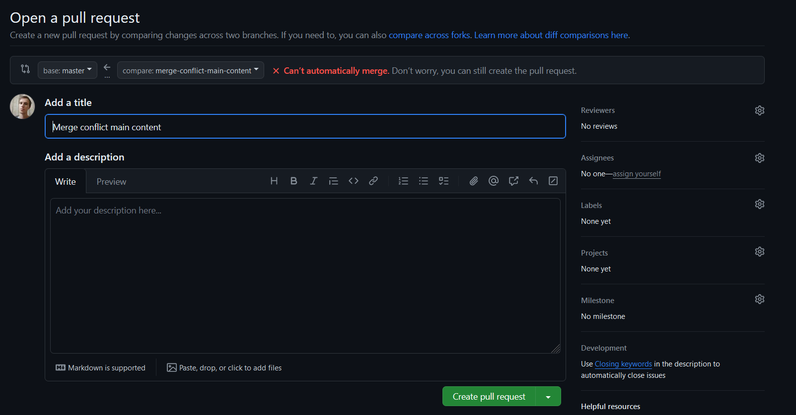

Следует выбрать ветки, для которых будет произведено слияние:
- слева находится ветка, в которой будет опубликована версия проекта после слияния (в нашем примере это feature-ветка `our-awesome-feature`);
- справа - ветка с вашими конфликтующими изменениями (в нашем примере - `merge-conflict-main-content`).

Также следует заполнить поля:
- **Add a title**: название вашего пулл-реквеста; отразите в нем краткую суть предлагаемых изменений, аналогично сообщению при коммите;
- **Add a description**: более детальное описание пулл-реквеста: например, указание причины внесенных вами изменений (в примере - результат обсуждения проекта на собрании) и их перечень;
- **Reviewers**: участники проекта, которые должны проверить и подтвердить, что внесенные изменения должны быть опубликованы в ветке, в которую производится слияние. Ревьюером может быть ваш руководитель, коллега, который внес изменения перед вами, и иные заинтересованные лица;
- **Assignee** - ответственый за результат слияния участник проекта;
- **Labels, projects, milestone** - опциональные поля для классификации пулл-реквеста по типу, проекту и ключевому результату (майлстоуну); полезны в крупных проектах для классификации большого количества пулл-реквестов.

Пример заполненной формы открытия пулл-реквеста:

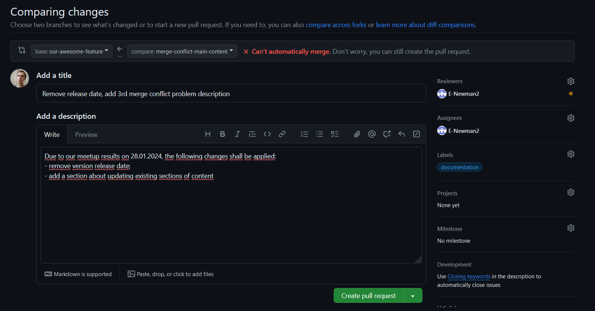

Проверив корректность введенных данных, нажмите на кнопку **Create pull request**.

4. Создав пулл-реквест, обсудите с заинтересованными участниками, какие изменения следует сохранить в нем. Это можно сделать на странице самого пулл-реквеста в разделе комментариев.

Например, в этом комментарии коллега уточняет внесенные вами правки.

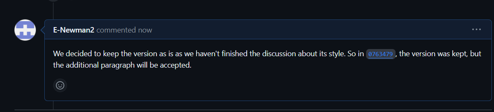

5. Обсудив изменения, внесите правки в обсуждаемый файл. Это можно сделать в редакторе самого GitHub, который можно открыть, нажав на ссылку **web editor** или на кнопку **Resolve conflicts** в блоке **This branch has conflicts that must be resolved**:

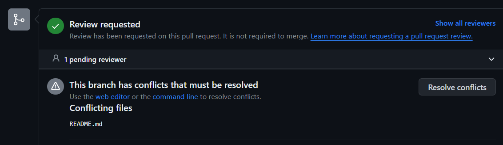

Интерфейс редактора:

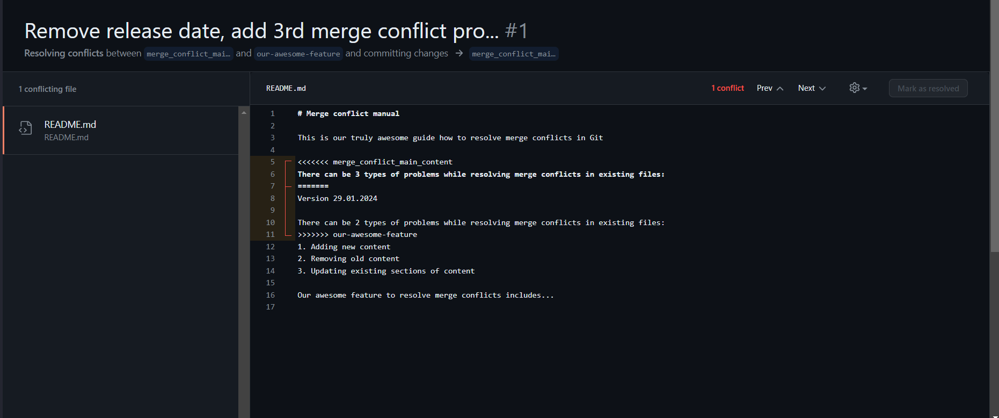

Аналогичным образом отредактировать файл могут его ревьюеры.

Отредактировав файл и разрешив конфликты в нем, нажмите на кнопку **Mark as resolved**, которая станет активной:

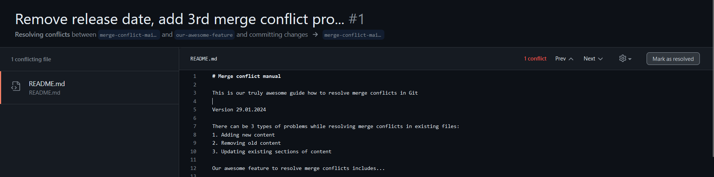

Когда статус файла поменяется на **Resolved**, следует сохранить изменения в удаленном репозитории, нажав на кнопку **Commit merge**:

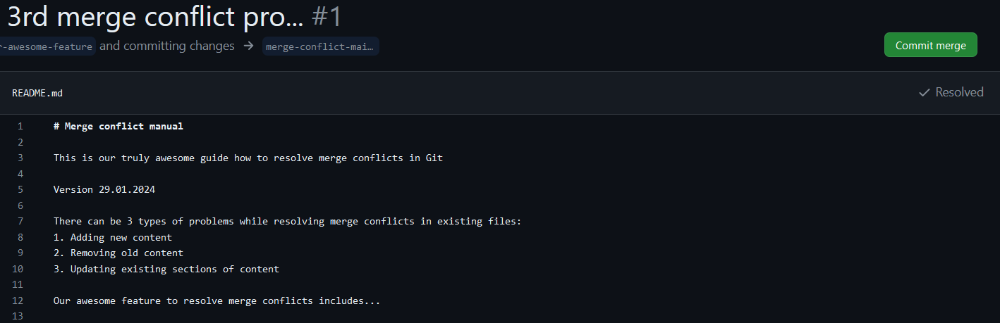

Например, после обсуждения и решения конфликтов README<i></i>.md принял вид:

```markdown
# Merge conflict manual

This is our truly awesome guide how to resolve merge conflicts in Git

Version 29.01.2024

There can be 3 types of problems while resolving merge conflicts in existing files:
1. Adding new content
2. Removing old content
3. Updating existing sections of content

Our awesome feature to resolve merge conflicts includes...
```

6. Когда будут решены все конфликты, возникшие при создании пулл-реквеста, на странице пулл-реквеста появится кнопка:

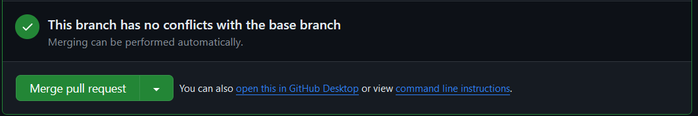

Нажмите на кнопку **Merge pull request**, чтобы завершить слияние временной ветки (`merge-conflict-main-content`) с feature-веткой (`our-awesome-feature`).

Заполните появившуюся форму, указав сообщение и описание коммита слияния, и нажмите на кнопку **Confirm merge**:

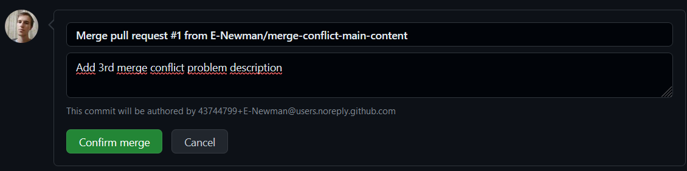

7. Когда коммит слияния будет успешно отправлен, появится форма, сообщающая, что временную ветку можно безопасно удалить:

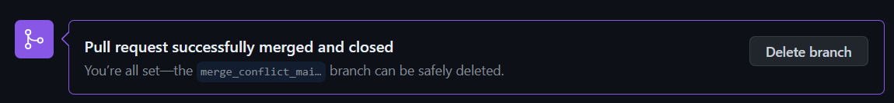

Нажмите на кнопку **Delete branch**, чтобы удалить созданную для решения конфликта ветку (`merge-conflict_main-content`). Изменения, внесенные в ходе пулл-реквеста, отобразятся в целевой ветке (`our-awesome-feature`):

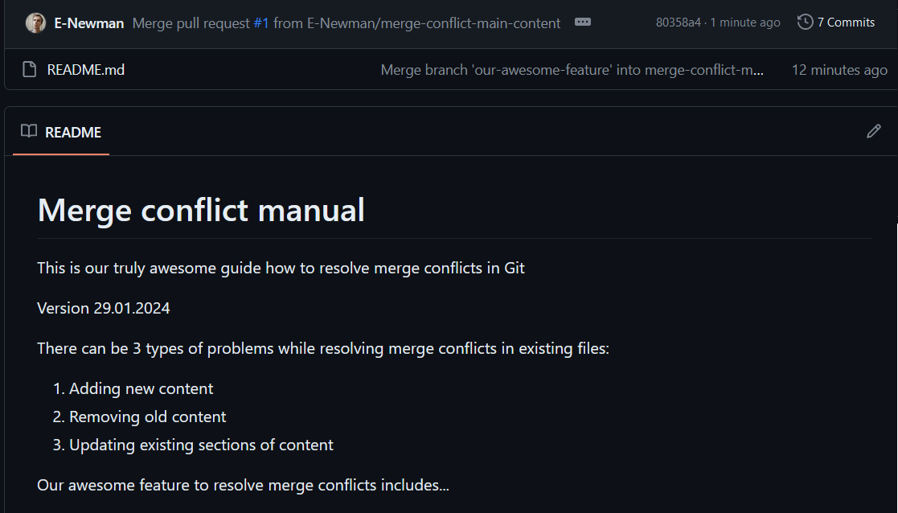

7. В локальном репозитории не забудьте переключиться на целевую ветку и синхронизировать изменения с удаленным репозиторием:

```bash
EP@E-NEWMAN-PC MINGW64 ~/Documents/GitHub/merge-conflict-manual (merge-conflict-main-content)
$ git checkout our-awesome-feature; git pull
Switched to branch 'our-awesome-feature'
Your branch is behind 'origin/our-awesome-feature' by 1 commit, and can be fast-forwarded.
  (use "git pull" to update your local branch)
remote: Enumerating objects: 8, done.
remote: Counting objects: 100% (8/8), done.
remote: Compressing objects: 100% (3/3), done.
remote: Total 4 (delta 1), reused 0 (delta 0), pack-reused 0
Unpacking objects: 100% (4/4), 1.88 KiB | 113.00 KiB/s, done.
From https://github.com/E-Newman/merge-conflict-manual
   0763479..80358a4  our-awesome-feature -> origin/our-awesome-feature
Updating ff73da7..80358a4
Fast-forward
 README.md | 7 ++++---
 1 file changed, 4 insertions(+), 3 deletions(-)

EP@E-NEWMAN-PC MINGW64 ~/Documents/GitHub/merge-conflict-manual (our-awesome-feature)
```

### Заключение

В случае конфликта между версиями файла на локальной машине и в удаленном репозитории следует:
1. создавать новую ветку для локальных изменений;
2. открывать пулл-реквест из ветки локальных изменений в удаленную ветку;
3. в рамках пулл-реквеста обсуждать конфликтующие изменения с заинтересованными коллегами;
4. завершив решение конфликтов и объединение изменений, удалять новую ветку и закрывать пулл-реквест.