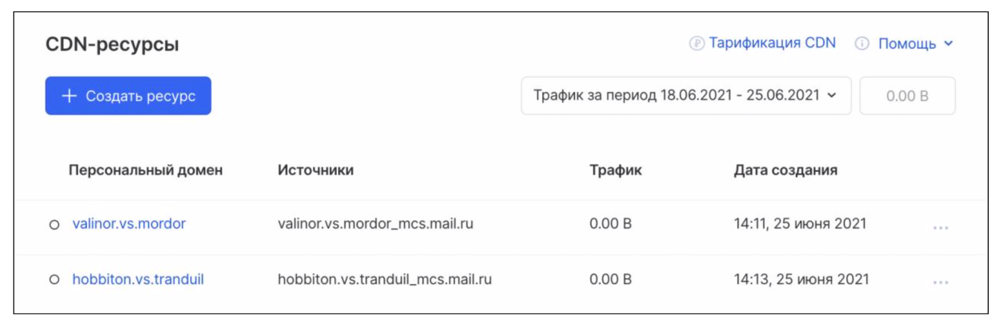
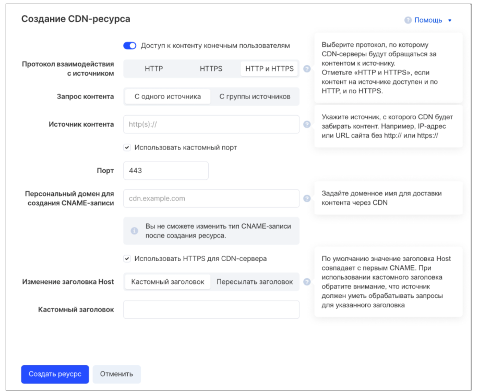
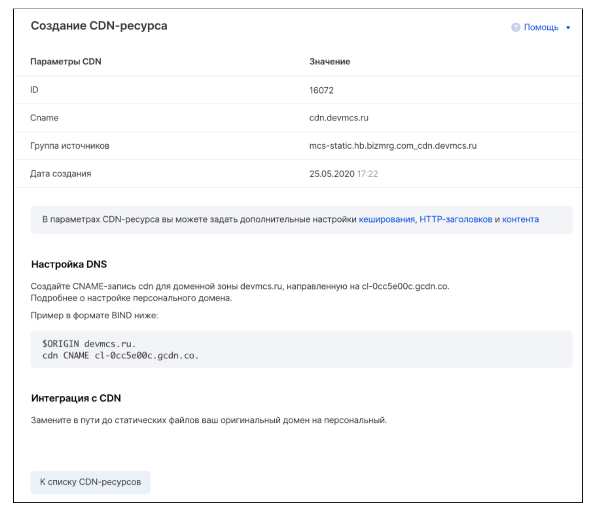

# Создание CDN-ресурса

## 1. Страница «CDN-ресурсы» 

На странице «CDN-ресурсы» нажмите на кнопку **«Создать ресурс»**:

## 2. Страница «Создание CDN-ресурса»

На открывшейся странице «Создание CDN-ресурса» заполните следующую форму:

* **Доступ к контенту конечным пользователям:** если флаг активен, то контент с CDN-ресурса будет отдаваться конечным пользователям источника контента. Иначе контент с CDN-ресурса будет отдаваться только администраторам CDN (например, в целях проверки работоспособности CDN), а конечные пользователи будут получать контент непосредственно с источника.

* **Протокол взаимодействия с источником:** по какому протоколу прикладного уровня CDN-ресурс должен обращаться за контентом к источнику.

* **Запрос контента:**
  * С одного источника: CDN-ресурс получает контент с одного источника (IP-адреса или доменного имени).
  * С группы источников: CDN-ресурс получает контент с нескольких источников (списка IP-адресов или доменных имен).

* **Источник контента:** информация об источнике (если в поле «Запрос контента» выбрана опция «С одного источника») или списке источников (опция «С группы источников»).
  <!--Поскольку скриншот формы создания CDN-ресурса в случае группы источников не приведен, описываю только случай одного источника, т.к. было бы некорректно писать документацию, основываясь на собственном предположении о внешнем виде формы-->
  <!--Касательно типов вводимых данных пояснения даны на основе информации о других CDN-сервисах (Yandex Cloud, CDNsun, Greypanel)-->
  В рамках данной инструкции рассматривается создание CDN-ресурса в случае одного источника контента. Для источника указывается:
  <!--Из скриншота не ясно, поддерживается ли IPv6-адрес источника, или только IPv4; однако в документации CDN Yandex Cloud (https://cloud.yandex.ru/ru/docs/cdn/concepts/origins#timeout) указано, что CDN-серверы не поддерживают протокол IPv6 и могут обращаться к источникам только по IPv4-адресам, поэтому указываю аналогичные типы допустимых адресов источника контента-->
  * IP-адрес в формате IPv4 (например, `192.168.0.1`);
  * или URL без http:// или https:// (например, `example.com`).
  <!--Плейсхолдер, на мой взгляд, конфликтует с комментарием к полю «Источник контента»: судя по плейсхолдеру, пользователь должен вводить префикс http(s)://, но комментарий к полю гласит: «Например, IP-адрес или URL сайта без http:// или https://»; при написании примечания отдал приоритет комментарию-->
  > **Важно:**
  > * в случае указания доменного имени источника контента протокол (http:// или https://) указывать не требуется, CDN-ресурс определит его на основе значения поля «Протокол взаимодействия с источником»;
  > * CDN-серверы не поддерживают протокол IPv6 и могут обращаться к источникам только по IPv4-адресам.
  * флаг «Использовать кастомный порт»: должен быть активен, если порт, по которому источник передает контент CDN-ресурсу, отличается от 80 (в случае использования протокола HTTP) или 443 (в случае использования HTTPS);
  <!--В других CDN-сервисах разрешены кастомные порты от 1024 до 65535: https://cdnsun.com/knowledgebase/cdn-static/setting-an-origin-port; также порты от 0 до 1023 зарезервированы для различных сетевых протоколов, поэтому их не рекомендуется переиспользовать: https://www.greypanel.com/en/custom-port/-->
  * порт: номер порта, по которому источник передает контент CDN-ресурсу, число в диапазоне от 1024 до 65535; необходимо заполнить, если активен флаг «Использовать кастомный порт».
<!--Поддерживаемые форматы доменного имени: https://cloud.yandex.ru/ru/docs/cdn/concepts/resource#hostnames-->
* **Персональный домен для создания CNAME-записи:** желаемое доменное имя (псевдоним) для CDN-ресурса. По умолчанию имя CDN-ресурса создастся автоматически и будет иметь вид `cl-ID.gcdn.co` (например, `cl-0cc5e0cc.gcdn.co`). В поле «Персональный домен для создания CNAME-записи» можно задать более короткое доменное имя CDN-ресурса в формате URL без указания протокола. Поддерживаются:
   - доменные имена на латинице (например, `cdn.example.com`);
   - доменные имена на кириллице в исходном виде (например, `пример.рф`);
   - доменные имена на кириллице в формате Punycode с префиксом `xn--` (например, `xn--e1afmkfd.xn--p1ai`).

  Инструкция по созданию CNAME-записи в случае использования персонального домена приведена в разделе [«Создание CDN-ресурса: завершение»](#3-создание-cdn-ресурса-завершение).
<!--Использование только HTTPS: https://cloud.yandex.ru/ru/docs/cdn/operations/resources/create-resource, п.7-->
* **Использовать HTTPS для CDN-сервера:** если флаг активен, то контент из CDN будет доступен конечным пользователям только по протоколу HTTPS, а запросы по протоколу HTTP будут автоматически перенаправлены на HTTPS.
<!--Кастомный заголовок Host: https://cloud.yandex.ru/ru/docs/cdn/concepts/servers-to-origins-host-->
* **Изменение заголовка Host:**
  * Кастомный заголовок: при выборе этой опции становится активным поле «Кастомный заголовок». В нем можно указать значение (произвольное доменное имя) заголовка Host, которое CDN-ресурс будет использовать при обращении к источнику контента. По умолчанию значение заголовка Host совпадает с CNAME CDN-ресурса (исходным или указанным в поле «Персональный домен для создания CNAME-записи»).
  * Пересылать заголовок: CDN-ресурс при запросе к источнику контента будет пересылать заголовок Host из запроса, полученного CDN-ресурсом от конечного пользователя.

Завершив заполнение формы создания CDN-ресурса, проверьте правильность введенных данных и нажмите на кнопку **«Создать ресурс»**.

## 3. Создание CDN-ресурса: завершение

На этой странице вы можете проверить параметры созданного ресурса: ID, CNAME, группу источников контента и дату создания. Также здесь находятся инструкции по созданию CNAME-записи для перенаправления запросов к персональному доменному имени вашего CDN-ресурса на имя по умолчанию и завершению интеграции вашего домена с CDN.

Нажатие на кнопку **«К списку CDN-ресурсов»** позволяет вернуться на страницу [«CDN-ресурсы»](#1-страница-cdn-ресурсы).